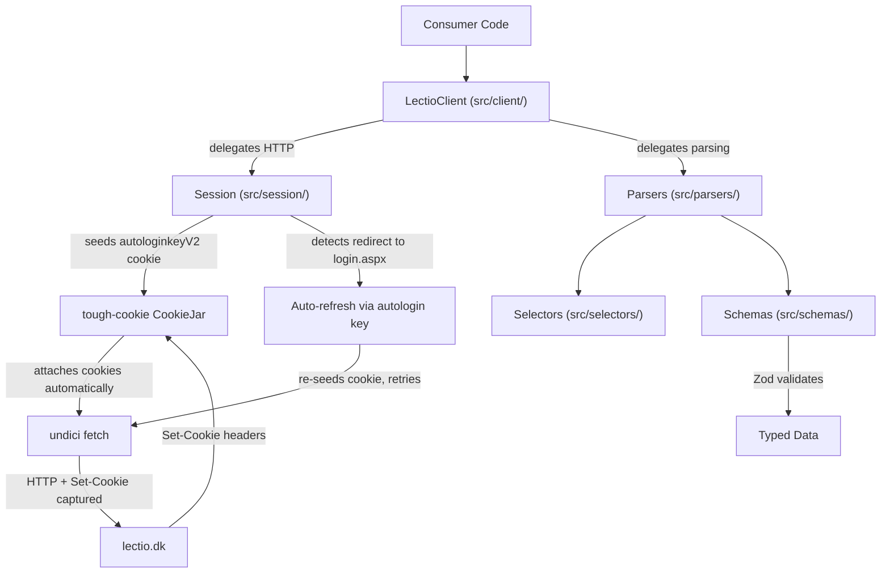

# lectio-ts Foundation Scaffold

## Project Tooling Setup

All config files live at the project root `/home/jonathan/code/lectio-ts/`.

- `**package.json**` -- Bun project with scripts for `build`, `test`, `lint`, `format`, `check`. Dependencies:
  - Runtime: `undici`, `tough-cookie`, `fetch-cookie`, `cheerio` (HTML parsing), `zod`
  - Dev: `vitest`, `msw`, `@biomejs/biome`, `tsup`, `typescript`, `@types/tough-cookie`
- `**tsconfig.json**` -- Strict mode, ESM module, target ES2022, `paths` alias `@/` to `src/`
- `**biome.json**` -- Formatter + linter config (replaces ESLint + Prettier)
- `**tsup.config.ts**` -- Dual ESM + CJS output with `.d.ts` declarations, entry `src/index.ts`
- `**vitest.config.ts**` -- Test config pointing at `tests/`, path aliases matching tsconfig

## Source Architecture



### Authentication Model -- Autologin Key (No Password Login)

There is **no username/password login**. The library is initialized with an `autologinKey` -- the value of Lectio's `autologinkeyV2` cookie. This is a long-lived token that Lectio sets when "remember me" is checked during browser login.

The authentication flow works like this:

1. The `autologinkeyV2` cookie is seeded into the `tough-cookie` CookieJar at construction time
2. On the first request (or on `connect()`), the session GETs a Lectio page; Lectio recognizes the autologin cookie and responds with `Set-Cookie` headers establishing `ASP.NET_SessionId` and `isloggedin3=Y`
3. The CookieJar automatically captures these session cookies and sends them on all subsequent requests
4. If a later request gets redirected to `login.aspx` (session expired), the session detects this, re-seeds `autologinkeyV2` into the jar, makes a fresh request to re-establish the session, and retries the original request

This mimics how a real browser with a persistent cookie jar behaves -- cookies accumulate, update via `Set-Cookie` headers, and never reset.

### `src/index.ts` -- Public barrel export

Exports `LectioClient`, all schema types, and error classes. This is the single entry point for consumers.

### `src/client/lectio-client.ts` -- Public API

```typescript
class LectioClient {
  constructor(options: {
    schoolId: number;
    autologinKey: string;
    debug?: boolean;
  });
  async connect(): Promise<SessionInfo>;
  async getSchedule(options?: {
    week?: string;
    studentId?: string;
  }): Promise<WeekSchedule>;
  // Future methods: getHomework(), getMessages(), getAbsence(), etc.
}
```

- `constructor` -- stores config, creates `Session` internally, seeds the autologin cookie into the jar
- `connect()` -- makes an initial request to establish the session; parses the response to extract `studentId` and verify authentication succeeded; returns `SessionInfo` with the student's identity
- `getSchedule()` -- fetches `SkemaNy.aspx`, delegates HTML to schedule parser
- All methods auto-refresh the session transparently if it expires mid-use (handled by Session layer)

### `src/session/session.ts` -- HTTP + Persistent Cookie Jar

```typescript
class Session {
  constructor(options: {
    schoolId: number;
    autologinKey: string;
    debug?: boolean;
  });
  async get(
    path: string,
    params?: Record<string, string>,
  ): Promise<SessionResponse>;
  async post(
    path: string,
    body: Record<string, string>,
  ): Promise<SessionResponse>;
  get isAuthenticated(): boolean;
  buildUrl(path: string): string;
}

interface SessionResponse {
  html: string;
  url: string;
  status: number;
}
```

Key behaviors:

- **Cookie jar is persistent** -- uses `tough-cookie.CookieJar` which stores cookies per-domain, respects `Set-Cookie` attributes (path, expiry, httpOnly), and sends the right cookies on each request automatically via `fetch-cookie` wrapping `undici`
- **Autologin seed** -- on construction, seeds `autologinkeyV2={key}` and `isloggedin3=Y` as cookies for `https://www.lectio.dk` into the jar
- **Browser-like headers** -- every request includes `User-Agent` (Chrome-like), `Accept-Language: da-DK,da;q=0.9,en-US;q=0.8,en;q=0.7`, `Accept`, `Connection: keep-alive`, `DNT: 1`, etc. (matching the reference at lines 20-33 of `schedule-extractor-api-test.ts`)
- **Redirect following** -- follows redirects, but detects when final URL is `login.aspx` (session expired)
- **Auto-refresh** -- on session expiry detection: clears stale session cookies from jar, re-seeds `autologinkeyV2`, makes a fresh GET to re-establish session, then retries the original request (max 1 retry to avoid loops)
- **Auth check** -- also checks response HTML for `/unilogin|log\s*ind/i` pattern as a secondary expiry signal (matching reference line 649)
- **Debug mode** -- logs request URL, response status, cookie changes, and optionally stores raw HTML

### `src/session/asp-net.ts` -- ASP.NET WebForms helpers

Lectio is an ASP.NET WebForms app. Form submissions require hidden fields:

- `extractAspNetFields(html: string)` -- extracts `__VIEWSTATEX`, `__VIEWSTATE`, `__EVENTVALIDATION`, `__EVENTARGUMENT`, `__SCROLLPOSITION`, `masterfootervalue` from hidden inputs
- `buildPostbackData(fields, eventTarget, extra)` -- merges ASP.NET fields with event target and custom form data

These are needed for any future POST-based operations (changing absence reasons, sending messages, etc.).

### `src/parsers/` -- Pure HTML-to-data functions

Each parser is a pure function: `(html: string) => T`. No network calls.

- `**auth.ts` -- `parseAuthState(html)` checks whether the page represents an authenticated session by looking for the `msapplication-starturl` meta tag containing `elevid` or `laererid`; returns `SessionInfo | null` with `studentId`, `isTeacher`, `schoolId`
- `**schedule.ts` -- `parseSchedule(html)` extracts the week schedule from the `s2skema` table, parsing each `s2skemabrik` element into structured lesson data

### `src/selectors/` -- Centralized CSS selectors

All CSS selectors and element patterns in one place so HTML structure changes only need updates here:

- `**common.selectors.ts` -- auth meta tag selector (`[name="msapplication-starturl"]`), login page detection patterns
- `**schedule.selectors.ts` -- schedule table ID, day headers (`.s2dayHeader`), lesson blocks (`.s2skemabrik`), status classes (`.s2normal`, `.s2changed`, `.s2cancelled`), data attributes (`data-brikid`, `data-date`, `data-tooltip`)

### `src/schemas/` -- Zod schemas + inferred TypeScript types

Each schema file exports both the Zod schema and the inferred TS type:

- `**session.ts` -- `SessionInfo` (studentId, isTeacher, schoolId)
- `**schedule.ts` -- `ScheduleLesson`, `ScheduleDay`, `WeekSchedule` (week number, year, days with lessons containing subject, teachers, rooms, time range, status, activityId)
- `**common.ts` -- Shared schemas like `Teacher`, `Room`, `Subject`

### `src/errors/` -- Custom error hierarchy

```typescript
class LectioError extends Error {
  /* base, all carry contextual info */
}
class AuthenticationError extends LectioError {
  /* autologin key invalid or expired */
}
class SessionExpiredError extends LectioError {
  /* session lost and auto-refresh failed */
}
class NetworkError extends LectioError {
  /* HTTP / connection issues */
}
class ParseError extends LectioError {
  /* HTML structure unexpected */
}
```

### `src/utils/` -- Shared helpers

- `**html.ts**` -- `loadHtml(raw: string)` wraps cheerio's `load()` for consistent usage
- `**url.ts**` -- URL building helpers, query param extraction
- `**debug.ts**` -- Conditional debug logger that respects the `debug` option

## Tests

### `tests/fixtures/`

Copy key HTML files from `reference/lectio-html/` as offline test fixtures:

- Authenticated page with meta tag (`forside.aspx.html` or `SkemaNy.aspx.html`)
- Schedule page (`SkemaNy.aspx.html`)
- A page that looks like a login redirect (if available, or craft a minimal one)

### `tests/unit/parsers/`

- `**schedule.test.ts**` -- Load HTML fixture, call `parseSchedule()`, assert structure matches schema, verify specific lessons are extracted correctly
- `**auth.test.ts**` -- Load HTML fixture, call `parseAuthState()`, verify studentId extraction and login-page detection

### `tests/unit/session/`

- `**asp-net.test.ts**` -- Test ASP.NET field extraction against raw HTML

### `tests/integration/`

- `**session.test.ts**` -- Use MSW to mock Lectio endpoints; test: (1) initial `connect()` flow with autologin cookie -> session established, (2) session expiry detection + auto-refresh retry, (3) invalid autologin key -> AuthenticationError
- MSW handlers defined in `tests/mocks/handlers.ts` and server in `tests/mocks/server.ts`

## File Tree Summary

```
lectio-ts/
  package.json
  tsconfig.json
  tsup.config.ts
  vitest.config.ts
  biome.json
  src/
    index.ts
    client/
      lectio-client.ts
      index.ts
    session/
      session.ts
      asp-net.ts
      index.ts
    parsers/
      auth.ts
      schedule.ts
      index.ts
    selectors/
      common.selectors.ts
      schedule.selectors.ts
      index.ts
    schemas/
      session.ts
      schedule.ts
      common.ts
      index.ts
    errors/
      index.ts
    utils/
      html.ts
      url.ts
      debug.ts
      index.ts
  tests/
    fixtures/
      (HTML snapshots from reference)
    unit/
      parsers/
        schedule.test.ts
        auth.test.ts
      session/
        asp-net.test.ts
    integration/
      session.test.ts
    mocks/
      handlers.ts
      server.ts
  reference/
    (existing, untouched)
```

## Key Implementation Details

**Session establishment flow:**

1. Constructor seeds cookies into the `tough-cookie` jar:

- `autologinkeyV2={autologinKey}` for domain `www.lectio.dk`, path `/`
- `isloggedin3=Y` for domain `www.lectio.dk`, path `/`

1. `connect()` GETs `/lectio/{schoolId}/forside.aspx` (or any authenticated page)
2. Lectio recognizes the autologin cookie and responds with `Set-Cookie: ASP.NET_SessionId=...; ...` headers
3. `tough-cookie` automatically captures these into the jar
4. Response HTML is parsed for the `msapplication-starturl` meta tag to extract `elevid` (student ID) -- confirming authentication
5. If instead the response redirects to `login.aspx`, throw `AuthenticationError` (the autologin key is invalid/expired)

**Session auto-refresh (transparent to consumers):**

1. On any `get()`/`post()`, if the response URL ends with `login.aspx` OR the HTML matches `/unilogin|log\s*ind/i`:
2. Clear `ASP.NET_SessionId` from the jar (stale)
3. Re-seed `autologinkeyV2` + `isloggedin3=Y`
4. Retry the original request exactly once
5. If retry also fails, throw `SessionExpiredError`

**Schedule parsing** (informed by `SkemaNy.aspx.html` fixture):

1. Find the schedule table via `.s2skema`
2. Extract day headers from `.s2dayHeader` cells
3. For each column, find `.s2skemabrik` elements
4. Extract: `data-brikid` (activity ID), status from classes (`s2normal`/`s2changed`/`s2cancelled`), `data-tooltip` for teacher/room/subject info, time parsing
5. Validate each lesson against the Zod schema

**Build output** -- tsup produces `dist/` with:

- `index.mjs` (ESM) + `index.js` (CJS)
- `index.d.ts` + `index.d.mts` (declarations)
- `package.json` `exports` map pointing to correct formats
